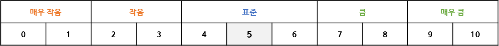

# OmnifitBrain
> Read in Korean: [KOREAN](README.md)

## Summary

This library is to support creating Android apps that can provide services using a device corresponding to Brain headsets among Omnifit products.
The functions provided by the library are organized below.

* Scanning/Cancelling Brain Headsets
* Connecting/Disconnecting Brain Headset
* Scanning and Connecting Brain Headset in Sequential
* Starting/terminating Measurement (Acquiring EEG Data)
* Obtaining Headset Information
* Monitoring Headset Status; connectivity status, electrode sensor attachment status, battery remaining, and more.

** The state indicating whether it is being searched, being connected, being measured, the state of the device, and the measured EEG data are all provided using Android's LiveData library.**

<br/>

## Library Usage Description

### Library initialization

To communicate with the brain product using a ViewModel class, you need to initialize the class first.<br/>
The ViewModel class name provided by the SDK is **OCWH20ViewModel**.

#### Using Activity-KTX

```kotlin
class SampleActivity: AppCompatActivity() {
    private val viewModel by viewModels<OCWH20ViewModel>()
}
```

#### Using ViewModelProvider

```kotlin
class SampleViewModelFactory(private val app: Application) : ViewModelProvider.Factory {
        override fun <T : ViewModel> create(modelClass: Class<T>): T {
            return modelClass.getConstructor(Application::class.java).newInstance(app)
        }
    }


class MainActivity : AppCompatActivity() {
    private var viewModel: OCWH20ViewModel? = null

    override fun onCreate(savedInstanceState: Bundle?) {
        super.onCreate(savedInstanceState)

        viewModel = ViewModelProvider(this, 
            SampleViewModelFactory(application))[OCWH20ViewModel::class.java]
    }
}
```

<br/>

### Scanning/Cancelling Brain headsets

The **find() function** in ViewModel starts searching for Brain devices and changes the **isScanning value** to true.<br/>
If the find() function is called again or the stopFind() function is called when the value of isScanning is true, the isScanning value changes to false and the search is canceled.
Brain devices are updated with scannedBluetoothDevices during scanning,
When the scan is completed, the device with the largest Rssi value is updated as the scannedBluetoothDevice.


#### find() Function Parameters

> duration : Time taken to search for a device.<br/>
> onError  : A callback that is called when an error occurs. Throwable is passed as an argument.

#### Usage Example

```kotlin
// Device search
viewModel.find(duration = 10, onError = { throwable ->
    runOnUiThread {
        Toast.makeText(applicationContext, throwable.message, Toast.LENGTH_SHORT).show()
    }
})

// Cancel device scanning
viewModel.Finding()

// Search status
viewModel.isScanning.observe(this@SampleActivity) { value ->
    if (value) {
        // true -> 'Searching'
    } else {
        // false -> 'Waiting'
    }
}
```

#### Result

```kotlin
viewModel.scannedBluetoothDevices.observe(this@SampleActivity) { devices ->
    // Peripheral Brain headsets
}

viewModel.scannedBluetoothDevice.observe(this@SampleActivity) { device ->
    // A Brain headset with maximum Rssi value (the closest device)
}
```

<br/>

### Connecting/Disconnecting Brain Headset

Calling the **connect() function** in ViewModel initiates a connection and changes **the value of isConnecting** to true.<br/>
When the isConnecting value is true, if the connect function is called again or the **disconnect() function** is called, the isConnecting value changes to false and the connection is disconnected.<br/>
For reference, if the connection is disconnected, you can receive the phrase `Disconnect from device` as a callback method.


#### connect() Function Parameters

> device        : The device you want to connect to. scannedBluetoothDevice is declared as default parameter.<br/>
> isAutoConnect : A Boolean value that sets the auto-connection option.<br/> 
> onError       : A callback that is called when an error occurs. Throwable is passed as an argument.

#### Usage Example

```kotlin
// Device connection
viewModel.connect(device = viewModel.scannedBluetoothDevice.value, isAutoConnect = false, onError = { throwable ->
    runOnUiThread {
        Toast.makeText(applicationContext, throwable.message, Toast.LENGTH_SHORT).show()
    }
})

// Device disconnection
viewModel.disconnect()

// Connection status
viewModel.isConnecting.observe(this@SampleActivity) { value ->
    if (value) {
        // true -> 'Connecting'
    } else {
        // false -> 'Waiting (not connected)'
    }
}
```

<br/>

### Scanning and Connecting Brain Headset in Sequential

Calling the ViewModel's **findWithConnect() function** will perform the search and connection sequentially.
If the function is called again while searching, the search will be stopped, and if the function is called again while the connection is being made, the connection will be disconnected.<br/>
Checking the **isScanningOrConnecting** value will tell you if that function is performing.

#### findWithConnect() Function Parameters

> duration : Time taken to search for a device.<br/>
> device   : If a device that has already been found is passed as an argument, only connection is performed without searhcing. null is declared as default parameter.<br/>
> onError  : A callback that is called when an error occurs. Throwable is passed as an argument.

#### Usage Example

```kotlin
// connect to headset after discovery
viewModel.findWithConnect(duration = 10, device = null, onError = { throwable ->
    Toast.makeText(applicationContext, throwable.message, Toast.LENGTH_SHORT).show()
})

// status of search and connection
viewModel.isScanningOrConnecting.observe(this@SampleActivity) { value ->
    if (value) {
        // true -> 'Scanning or Connecting '
    } else {
        // false -> 'Waiting'
    }
}
```

<br/>

### Starting/terminating Measurement

<br/>

Calling the **startMeasuring() function** of the ViewModel will start the measurement and change the **isMeasuring value** to true<br/>
If the startMeasuring function is called again or the **stopMeasuring function** is called when the isMeasuring value is true, the isMeasuring value changes to false and the measurement ends.
Alternatively, the measurement ends when the measurement time passed as a factor is over.<br/>
When measurement starts, LiveData<Result> named 'result' is updated every 2 seconds.<br/>
The details of the EEG measurement data set by the Result data class property are as follows.


### Acquiring Result data

|**Property**|**Data Classification**|**Definition**|**Range**|
|:---:|:---:|:---:|:---:|
|isLossOccur|`Packet loss occurrence check value`|boolean to check whether packet loss has occurred|true, false|
|leftThetaIndicatorValue|`Left brain theta size value`|size value for absolute power of left brain theta wave(4-8Hz)|0~10|
|rightThetaIndicatorValue|`Right brain theta size value`|size value for absolute power of right brain theta wave(4-8Hz)|0~10|
|leftAlphaIndicatorValue|`Left brain alpha size value`|size value for absolute power of left brain alpha wave(8-12Hz)|0~10|
|rightAlphaIndicatorValue|`Right brain alpha size value`|size value for absolute power of right brain alpha wave(8-12Hz)|0~10|
|leftLowBetaIndicatorValue|`Left brain low-beta size value`|size value for absolute power of left brain low-beta wave(12-15Hz)|0~10|
|rightLowBetaIndicatorValue|`Right brain low-beta size value`|size value for absolute power of right brain low-beta wave(12-15Hz)|0~10|
|leftMiddleBetaIndicatorValue|`Left brain middle-beta size value`|size value for absolute power of left brain middle-beta wave(15-20Hz)|0~10|
|rightMiddleBetaIndicatorValue|`Right brain middle-beta size value`|size value for absolute power of right brain middle-beta wave(15-20Hz)|0~10|
|leftHighBetaIndicatorValue|`Left brain high-beta size value`|size value for absolute power of left brain high-beta wave(20-30Hz)|0~10|
|rightHighBetaIndicatorValue|`Right brain high-beta size value`|size value for absolute power of right brain high-beta wave(20-30Hz)|0~10|
|leftGammaIndicatorValue|`Left brain gamma size value`|size value for absolute power of left brain gamma wave(30-40Hz)|0~10|
|rightGammaIndicatorValue|`Right brain gamma size value`|size value for absolute power of right brain gamma wave(30-40Hz)|0~10|
|concentrationIndicatorValue|`Concentration size value`|size value of concentration|0~10|
|leftRelaxationIndicatorValue|`Left brain relaxation size value`|size value of left brain relaxation|0~10|
|rightRelaxationIndicatorValue|`Right brain relaxation size value`|size value of right brain relaxation|0~10|
|unbalanceIndicatorValue|`Left-Right brain balance size value`|size value of left-right brain balance|0~10|
|leftPowerSpectrum|`Left Brain Power Spectrum`|left brain power spectrum (double array with indices 0 to 73)|each element is between 0 and 655.35|
|rightPowerSpectrum|`Right Brain Power Spectrum`|right brain power spectrum (double array with indices 0 to 73)|each element is between 0 and 655.35|
|leftThetaPowerSpectrum|`Left brain theta power spectrum value`|theta power spectrum value of left brain|0~655.35 * 8|
|rightThetaPowerSpectrum|`Right brain theta power spectrum value`|theta power spectrum value of right brain|0~655.35 * 8|
|leftAlphaPowerSpectrum|`Left brain alpha power spectrum value`|alpha power spectrum value of left brain|0~655.35 * 8|
|rightAlphaPowerSpectrum|`Right brain alpha power spectrum value`|alpha power spectrum value of right brain|0~655.35 * 8|
|leftLowBetaPowerSpectrum|`Left brain low-beta power spectrum value`|low-beta power spectrum value of left brain|0~655.35 * 6|
|rightLowBetaPowerSpectrum|`Right brain low-beta power spectrum value`|low-beta power spectrum value of right brain|0~655.35 * 6|
|leftMidBetaPowerSpectrum|`Left brain middle-beta power spectrum value`|middle-beta power spectrum value of left brain|0~655.35 * 10|
|rightMidBetaPowerSpectrum|`Right brain middle-beta power spectrum value`|middle-beta power spectrum value of right brain|0~655.35 * 10|
|leftHighBetaPowerSpectrum|`Left brain high-beta power spectrum value`|high-beta power spectrum value of left brain|0~655.35 * 21|
|rightHighBetaPowerSpectrum|`Right brain high-beta power spectrum value`|high-beta power spectrum value of right brain|0~655.35 * 21|
|leftGammaPowerSpectrum|`Left brain gamma power spectrum value`|gamma power spectrum value of left brain|0~655.35 * 21|
|rightGammaPowerSpectrum|`Right brain gamma power spectrum value`|gamma power spectrum value of right brain|0~655.35 * 21|
|leftTotalPowerSpectrum|`Left brain total power spectrum value`|total power spectrum value of left brain|0~655.35 * 74|
|rightTotalPowerSpectrum|`Right brain total power spectrum value`|total power spectrum value of right brain|0~655.35 * 74|
|leftThetaRatio|`Left brain theta ratio`|ratio of left brain theta waves|0~100|
|leftAlphaRatio|`Left brain alpha ratio`|ratio of left brain alpha waves|0~100|
|leftLowBetaRatio|`Left brain low-beta ratio`|ratio of left brain low-beta waves|0~100|
|leftMidBetaRatio|`Left brain middle-beta ratio`|ratio of left brain middle-beta waves|0~100|
|leftHighBetaRatio|`Left brain high-beta ratio`|ratio of left brain high-beta waves|0~100|
|leftGammaRatio|`Left brain gamma ratio`|ratio of left brain gamma waves|0~100|
|rightThetaRatio|`Right brain theta ratio`|ratio of right brain theta waves|0~100|
|rightAlphaRatio|`Right brain alpha ratio`|ratio of right brain alpha waves|0~100|
|rightLowBetaRatio|`Right brain low-beta ratio`|ratio of right brain low-beta waves|0~100|
|rightMidBetaRatio|`Right brain middle-beta ratio`|ratio of right brain middle-beta waves|0~100|
|rightHighBetaRatio|`Right brain high-beta ratio`|ratio of right brain high-beta waves|0~100|
|rightGammaRatio|`Right brain gamma ratio`|ratio of right brain gamma waves|0~100|
|leftSEF90|`Left brain SEF90`|left brain SEF90|0~36.11|
|rightSEF90|`Right brain SEF90`|right brain SEF90|0~36.11|

<br/>

#### Power spectral interval (frequency increment per index is 0.488 Hz)

|**Data Classification**|**Hz Range**|**Index Range**|**Count**|
|:---:|:---:|:---:|:---:|
|THETA|4 ~ 8Hz|left/rightPowerSpectrum[0 ~ 7]|8|
|ALPHA|8 ~ 12Hz|left/rightPowerSpectrum[8 ~ 15]|8|
|L-BETA|12 ~ 15Hz|left/rightPowerSpectrum[16 ~ 21]|6|
|M-BETA|15 ~ 20Hz|left/rightPowerSpectrum[22 ~ 31]|10|
|H-BETA|20 ~ 30Hz|left/rightPowerSpectrum[32 ~ 52]|21|
|GAMMA|30 ~ 40Hz|left/rightPowerSpectrum[53 ~ 73]|21|

<br/>

#### Use of Result data size values

The properties up to leftThetaIndicatorValue, rightThetaIndicatorValue, leftAlphaIndicatorValue, ..., leftRelaxationIndicatorValue, rightRelaxationIndicatorValue, and unbalanceIndicatorValue of Result data have size values.



* For all other properties except unbalanceIndicatorValue, a value of 5 is standard, and as it converges to 0, it means a very low state, and as it converges to 10, it indicates a very high state.
* As for unbalanceIndicatorValue, a value of 5 means left-brain balance, and as it converges to 0, it means that the right brain is activated, and as it converges to 10, it means that the left brain is activated.

<br/>

### 두뇌 점수 획득

ViewModel의 **getBrainScore 함수**를 호출하면 두뇌 점수를 획득할 수 있습니다.
인자로 ArrayList<Result>를 넘기면 되고, 리턴값은 Int 타입의 두뇌 점수입니다.
<br/>
단, getBrainScore는 인자로 넘긴 리스트가 비어있거나, 측정하는 동안 장치를 잘못 착용하여 뇌파 데이터 전체가 사용할 수 없는 경우 IllegalArgumentException을 던집니다.
오류의 내용은 에러 객체의 message 프로퍼티를 통해서 확인할 수 있습니다.

#### getBrainScore 함수 매개 변수

> results : ArrayList<Result> 타입의 매개 변수. 측정이 진행된 시간동안 Result 데이터 클래스를 ArrayList로 모은 후 인자로 넘기면 됨.

#### 사용 예시
```kotlin
// resultList(ArrayList<Result>에 값이 있다고 가정)
try {
    val score = viewModel.getBrainScore(resultList)
    Timber.d("[SCORE] : $score")
} catch (e: IllegalArgumentException) {
    Timber.e("[IllegalArgumentException] - error : ${e.message}")
}
```

<br/>

#### startMeasuring() Function Parameters

> measuringTime : measurement run time<br/>
> eyeState      : state of whether the eyes are open or closed.<br/>
> onError       : A callback that is called when an error occurs. Throwable is passed as an argument.

#### Usage Example

```kotlin
// Start device measurement
viewModel.startMeasuring(measuringTime = 60, eyesState = Result.EyesState.CLOSED, onError = { throwable ->
    runOnUiThread {
      Toast.makeText(applicationContext, throwable.message.toString(), Toast.LENGTH_SHORT).show()
    }
})
// End device measurement
viewModel.stopMeasuring()
// Check measurement status
viewModel.isMeasuring.observe(this@SampleActivity) { value ->
  if (value) {
    // true -> 'Measuring'
  } else {
    // false -> 'Waiting'
  }
}
// EEG data
viewModel.result.observe(this@SampleActivity) { value ->
    println("Result : $value")
}
```

<br/>

### Obtaining Headset Information

Once the connection with the device is established, you can get the **device serial number, measurement state transition time, and signal stability threshold**.<br/>
When you call the following functions, the result is passed to the callback function.

* Device serial number: A serial number assigned to the device
* Measurement status conversion time: Measurement status conversion time value applied to the device
* Signal stabilization reference value: EEG stabilization value recorded in the device

#### Usage Example

```kotlin
// Device serial number
viewModel.readSerialNo(block = { serialNumber ->
    Toast.makeText(applicationContext, serialNumber, Toast.LENGTH_LONG).show()
})

// Measurement status conversion time
viewModel.readMeasureStartChangeTime(block = { time ->
    Toast.makeText(applicationContext, time, Toast.LENGTH_LONG).show()
})

// Signal stabilization reference value
viewModel.readSignalStability(block = { signalStability ->
    Toast.makeText(applicationContext, signalStability, Toast.LENGTH_LONG).show()
})
```

<br/>

### Monitoring Headset Status

You can use the following LiveData to determine the current state of your device.

* electrodeStatus : electrode sensor attachment status
* batteryLevel : remaining battery status
* eegStabilityValue : eeg stability status

#### Electrode Sensor Attachment Status

```kotlin
/**
 * ALL_DETACHED -> all detached
 * LEFT_ELECTRODE_DETACHED -> left eeg sensor detached
 * RIGHT_ELECTRODE_DETACHED -> right eeg sensor detached
 * LEFT_EARPHONE_DETACHED -> left, right eeg sensor detached
 * RIGHT_EARPHONE_DETACHED -> earphone detached
 * ALL_ATTACHED -> all attached
 */
viewModel.electrodeStatus.observe(this@SampleActivity) { state ->
    when (state) {
        Result.Electrode.ALL_DETACHED              -> {}
        Result.Electrode.LEFT_ELECTRODE_DETACHED   -> {}
        Result.Electrode.RIGHT_ELECTRODE_DETACHED  -> {}
        Result.Electrode.LEFT_EARPHONE_DETACHED    -> {}
        Result.Electrode.RIGHT_EARPHONE_DETACHED   -> {}
        Result.Electrode.ALL_ATTACHED              -> {}
    }
}
```

<br/>

#### Remaining Battery Status

```kotlin
/**
 * INSUFFICIENT -> device battery is low
 * SUFFICIENT -> device battery is sufficient
 */
viewModel.batteryLevel.observe(this@SampleActivity) { level ->
    when (level) {
        Result.BatteryLevel.INSUFFICIENT -> {}
        Result.BatteryLevel.SUFFICIENT   -> {}
    }
}
```

<br/>

#### EEG Stability Status

```kotlin
/**
 * UNSTABILIZED -> unstabilized eeg
 * STABILIZED -> stabilized eeg
 */
viewModel.eegStabilityValue.observe(this@MainActivity) { value ->
    when (value) {
        Result.EEGStability.UNSTABILIZED -> {}
        Result.EEGStability.STABILIZED   -> {}
    }
}
```

<br/>

### Setting Library Reference

#### Gradle File (App Level)

```groovy
dependencies {
    implementation 'omnifit.sdk:omnifit-brain-ktx:0.0.4'
}
```

<br/>

#### settings.gradle File

```groovy
dependencyResolutionManagement {
    repositoriesMode.set(RepositoriesMode.FAIL_ON_PROJECT_REPOS)
    repositories {
        google()
        mavenCentral()
        maven { url 'http://maven.omnicns.co.kr/nexus/content/repositories/releases/'; allowInsecureProtocol true }
    }
}
```

<br/>

## License

    Copyright 2022 omniC&S

    Licensed under the Apache License, Version 2.0 (the "License");
    you may not use this file except in compliance with the License.
    You may obtain a copy of the License at

       http://www.apache.org/licenses/LICENSE-2.0

    Unless required by applicable law or agreed to in writing, software
    distributed under the License is distributed on an "AS IS" BASIS,
    WITHOUT WARRANTIES OR CONDITIONS OF ANY KIND, either express or implied.
    See the License for the specific language governing permissions and
    limitations under the License.
